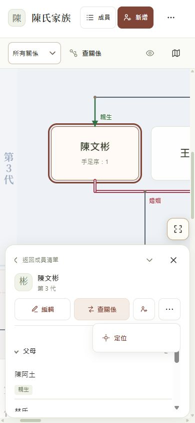
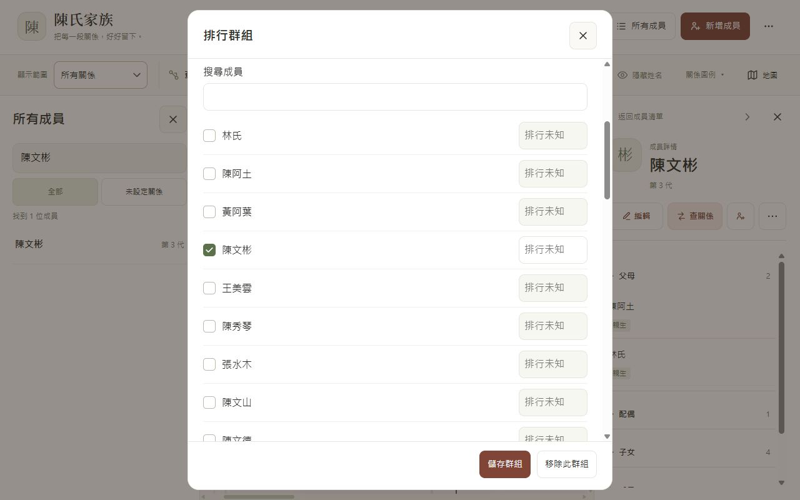
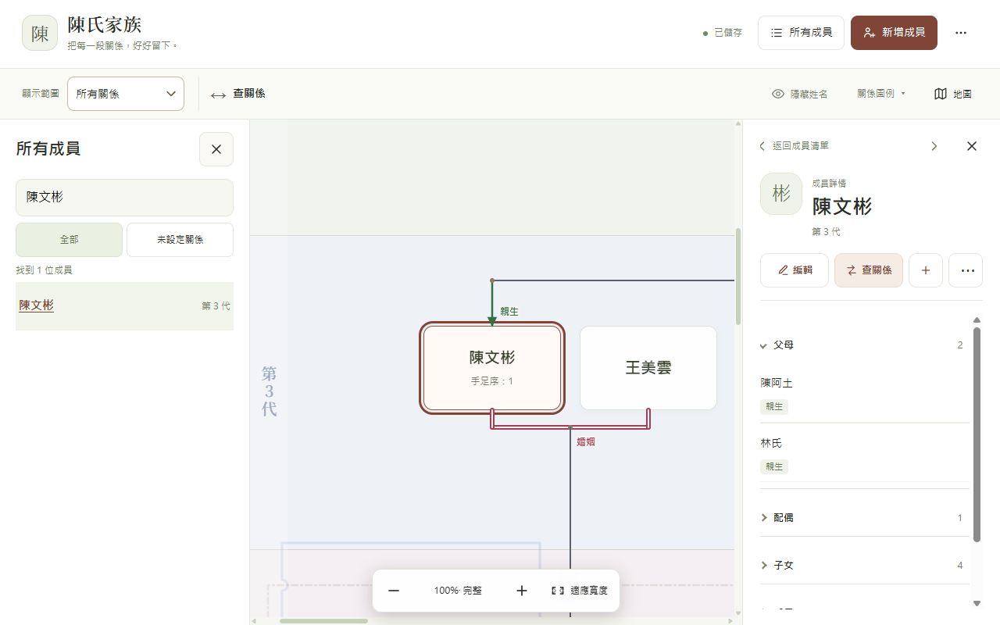
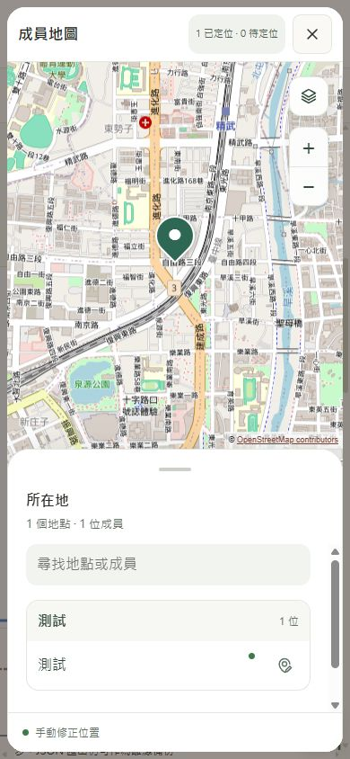

# Apple Design layout 實作驗證

日期：2026-10-03。已將核准的 layout template 套用至 `src/` 正式介面。

## 實作

- 標題與儲存狀態、工具列、桌面成員清單／詳情雙側欄、手機成員清單。
- 任務分組的更多選單、固定復原入口與 Ctrl／Cmd+Z。
- 各尺寸一致的查詢方向、姓名問句、結果列與完整路徑視窗。
- 編輯表單、保留草稿的最新資料比較、欄位旁錯誤提示。
- 明確的捨棄、匯入與雲端版本選擇語意。
- 關係依據 SVG 為 14px，展開旋轉 180°；姓名顯示按鈕切換 eye／eye-off。

## 地圖串接

保留 `member-map.css`、地圖元件與地點修正流程；新樣式在地圖樣式之前載入。工具列使用原本的 `show-member-map` 按鈕與 listener。

補上外部成員選取的範圍處理：從地圖或成員清單選取目前查詢／家族範圍外的成員時，先顯示該成員，再展開詳情。

## 驗證

- `node --test --test-concurrency=1 tests/*.test.cjs`：145 通過、0 失敗。
- 修改的 JavaScript 語法檢查通過；`node dev/build.cjs` 成功。
- 瀏覽器尺寸：1280×800、1024×768、390×844、844×390。
- 草稿姓名／備註／7 筆關係保留、儲存、全域復原；姓名與排行就近錯誤提示。
- 查詢方向、交換、結果與完整關係路徑；SVG 尺寸／箭頭轉向；姓名 icon 狀態。
- 地圖底圖載入、工具列開圖、詳情所在地開圖、清單展開、底圖選單、中央準星指定位置、儲存／復原、地圖返回詳情。
- 私人所在地不出現在地圖；復原編輯後恢復位置顯示。
- 正式瀏覽器儲存模式：匯入 38 位成員，重新整理後資料保留；未啟用雲端的提示正確。

所有資料操作使用 fixture 的隔離複本或獨立的 localhost 瀏覽器儲存空間，未修改原始族譜檔。

尚未驗證真實 Google OAuth／Drive 帳號同步、實體手機鍵盤與 VoiceOver。

## 2026-10-04 對齊與圖示修正

- 詳情更多改為無可見文字的 SVG，44px 按鈕內水平置中；展開內容以一致的寬度、留白與左對齊呈現。
- 排行 checkbox／姓名以 flex 垂直置中；native checkbox 統一圓角、選取色與 focus／disabled／forced-colors 狀態。
- 工具列查關係圖示直接沿用更多選單的 SVG；切換至更換成員時保留圖示。
- 新增成員、第一位成員與新增親屬統一 person-plus；恢復行動版新增圖示，320px 版面以 icon 按鈕保留操作空間。
- 量測：桌面與手機更多圖示中心偏移 0px；排行 checkbox 與姓名垂直中心偏移 0px。鍵盤 Space 可勾選並啟用排行。
- 驗證 1280×800、390×844、320×740、844×390；145 項測試通過、建置成功。

## 檢視

- 正式介面、隔離示例資料：<http://127.0.0.1:4180/family-tree.html>
- 瀏覽器儲存模式：<http://127.0.0.1:4181/family-tree.html>
- 啟動：`node dev/apple-layout-preview.cjs`；瀏覽器儲存模式加上 `--browser-storage`。

